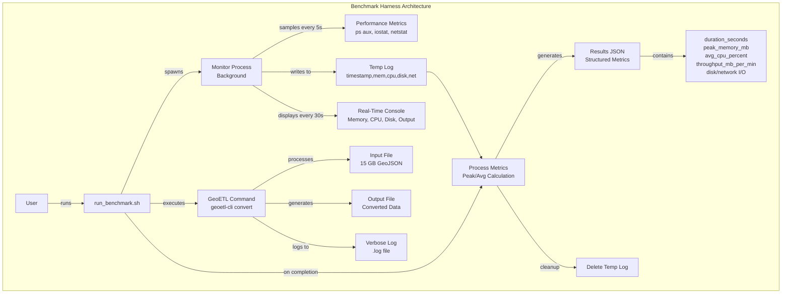

# Building GeoETL's Benchmarking Infrastructure: From Guesswork to Data

**TL;DR**: We built systematic benchmarking for GeoETL and achieved **1.43x faster performance** (45 min vs 65 min) while processing 15 GB files in just **77 MB of RAM**. Here's how benchmarking shaped our architecture, identified bottlenecks, and guides future improvements.

<!--truncate-->

## The Problem

When building GeoETL, we faced a fundamental question: **How do you optimize a tool that processes files larger than RAM?**

Manual testing wasn't cutting it:
- Time-consuming and inconsistent results
- Memory profilers showed only part of the story
- Different configurations produced wildly different results
- No systematic way to compare changes

We needed benchmarking that could:
- Measure performance across different configurations
- Track multiple metrics: memory, CPU, disk I/O, network I/O, throughput
- Monitor long-running tests in real-time
- Generate structured data for analysis
- Work for the entire team without a learning curve

## The Legacy Format Challenge

**GeoJSON wasn't designed for performance.**

Created in 2008 ([RFC 7946](https://datatracker.ietf.org/doc/html/rfc7946) in 2016), GeoJSON predates big data and streaming architectures. It prioritized simplicity over speed:

**Design limitations:**
- **Text-based JSON**: Verbose, requires parsing every character
- **No schema declaration**: Must infer structure by scanning data
- **Variable properties**: Different features can have different fields
- **No chunking mechanism**: FeatureCollection is one monolithic array
- **No compression**: Raw JSON can be 5-10x larger than binary formats
- **No indexes**: Sequential access only, can't skip to specific features

**Why this matters:**

Modern formats (Parquet, Arrow) are built for performance: compression, schema metadata, columnar layout, binary encoding. GeoJSON? You fight the format at every step.

**Systematic benchmarking becomes critical.** You can't just "make it faster" - you need to understand bottlenecks, measure each optimization, and prove your changes work.

**The broader lesson:**

Legacy formats (CSV, XML, JSON, shapefiles) weren't designed for:
- Multi-GB files with limited RAM
- Cloud storage with high latency
- Concurrent processing across cores
- Modern data pipelines (Spark, DataFusion, DuckDB)

**For GeoETL, benchmarking was essential.** It let us:
- Find the real bottleneck: JSON parsing, not I/O
- Discover optimal batch size: 262K features
- Prove streaming maintains O(1) memory
- Validate 1.43x performance improvement
- Confirm it works at scale: 15 GB files in 77 MB RAM

We built benchmarking infrastructure before major optimizations. With legacy formats, you must understand the problem before solving it. Benchmarks didn't just make GeoETL faster—they shaped the architecture.

## What We Built

Three components form our benchmark harness:



#### 1. **Automated Performance Monitoring** (`run_benchmark.sh`)

A bash script that wraps any command with comprehensive performance monitoring:

```bash
bench/run_benchmark.sh "./target/release/geoetl-cli convert \
  --input bench/data/final/microsoft-buildings_point.geojson \
  --output bench/output/test.geojson \
  --input-driver GeoJSON \
  --output-driver GeoJSON" \
  "geojson-streaming"
```

This single command automatically:
- Samples performance metrics every 5 seconds
- Displays real-time progress updates every 30 seconds
- Tracks peak memory, average CPU, disk I/O, network I/O, and thread-level CPU usage
- Saves structured JSON results and verbose logs
- Calculates throughput and resource utilization

#### 2. **Real-Time Progress Monitoring**

For long tests (45+ minutes), live updates every 30 seconds:

```
========================================
GeoETL Benchmark
========================================
Test: geojson-streaming-optimal
Input Size: 15000.00 MB
========================================

Monitoring (updates every 30s)...
System: 10 cores available
========================================
[00:30] Mem: 45.2 MB | CPU: 98.5% (9.9%/core) | Disk: 1.2r/12.5w MB/s | Output: 102.5 MB
[01:00] Mem: 68.1 MB | CPU: 99.1% (9.9%/core) | Disk: 1.3r/14.2w MB/s | Output: 405.8 MB
...
[44:30] Mem: 77.2 MB | CPU: 98.2% (9.8%/core) | Disk: 1.4r/15.1w MB/s | Output: 14850.3 MB
```

Why this matters:
- Verify tests run correctly
- Detect anomalies early
- Understand resource patterns
- Build confidence

#### 3. **Structured Output for Analysis**

Every benchmark produces two artifacts:

**JSON metrics file** (`bench/results/test-name.json`):
```json
{
  "test_name": "geojson-streaming-optimal",
  "command": "./target/release/geoetl-cli convert ...",
  "metrics": {
    "duration_seconds": 2700,
    "duration_minutes": 45.00,
    "peak_memory_mb": 77.2,
    "avg_cpu_percent": 98.5,
    "avg_disk_read_mb_per_sec": 1.43,
    "avg_disk_write_mb_per_sec": 14.34,
    "avg_network_in_mb": 0.04,
    "avg_network_out_mb": 0.04,
    "input_size_mb": 15000.00,
    "output_size_mb": 15001.23,
    "throughput_mb_per_min": 333.33
  },
  "exit_code": 0
}
```

**Verbose log file** (`bench/results/test-name.log`):
- Complete command output with `--verbose` flag
- Error messages and stack traces
- Detailed processing information

This structure enables:
- Programmatic comparison of results (`jq '.metrics' bench/results/*.json`)
- Tracking performance regressions over time
- Sharing reproducible results with the team
- Building performance dashboards

## How We Used It: The Optimization Story

### Phase 1: Baseline

Test dataset: **Microsoft Buildings** from [GeoArrow Data](https://github.com/geoarrow/geoarrow-data/)
- 15 GB GeoJSON
- 129.7 million points
- Real production data

Baseline (8,192 batch size):
```
Duration:    65 min
Peak Memory: 34 MB
Throughput:  230 MB/min
```

### Phase 2: Finding Optimal Batch Size

| Batch Size | Memory | Time | Throughput | vs Baseline |
|-----------|--------|------|-----------|-------------|
| 2,048 | 15 MB | 150 min | 100 MB/min | 0.43x |
| **8,192 (default)** | **34 MB** | **65 min** | **230 MB/min** | **1.0x** |
| 32,768 | 73 MB | 54 min | 278 MB/min | 1.2x |
| 131,072 | 75 MB | 48 min | 312 MB/min | 1.35x |
| **262,144 ✓** | **77 MB** | **45 min** | **330 MB/min** | **1.43x** |
| 524,288 | 80 MB | 50 min | 300 MB/min | 1.3x |
| 2,097,152 | 75 MB | 66 min | 227 MB/min | 0.99x |

**Results:**
- Memory stayed constant (15-80 MB) - streaming works
- Optimal: 262K features
- Beyond 256K: diminishing returns
- **1.43x speedup with minimal memory increase**

### Phase 3: Identifying the Bottleneck

```
CPU:     98-100% (maxed out)
Disk:    1.4r/14.3w MB/s (well below capacity)
Network: Negligible
Threads: Single thread at 99%, others idle
```

**Diagnosis**: CPU-bound on JSON parsing, not I/O. See [ADR 001](https://github.com/geoyogesh/geoetl/blob/main/docs/adr/001-streaming-geojson-architecture.md).

### Phase 4: Apply Optimal Settings

Updated codebase with 262K batch size:

`physical_exec.rs:45`:
```rust
batch_size: 262144,  // Optimal: 256K features
```

`decoder.rs:44`:
```rust
buffer: Vec::with_capacity(256 * 1024),
```

`operations.rs:47-50`:
```rust
let config = SessionConfig::new()
    .with_batch_size(262144)
    .with_target_partitions(num_cpus::get());
```

## Impact on GeoETL

Benchmarking transformed how we build GeoETL:

**1. Data-Driven Decisions**
Before: "Let's try bigger batch size."
After: "7 tests show 262K is optimal."

**2. Confidence in Changes**
Validate performance before merging PRs.

**3. Reproducible Results**
Anyone can verify our claims.

**4. Future-Proof**
Measure impact of new features.

**5. User Empowerment**
Users can find optimal settings for their data.

## Design Principles

**Always Collect, Conditionally Display**
All metrics saved to JSON. Display flags control console output.

**Real-Time Updates**
30-second progress for long tests (45+ min).

**Cross-Platform**
Works on macOS and Linux (ps, iostat, netstat, stat).

**Zero Dependencies**
Pure bash using standard Unix tools.

## Lessons

**1. Metrics Need Context**
77 MB memory means nothing without "processing 15 GB files."

**2. Automation Wins**
Consistency by default vs. requiring discipline.

**3. Visibility Builds Confidence**
30-second updates make black boxes transparent.

**4. Diminishing Returns Exist**
Beyond 262K: slower. Find the optimal point.

**5. Bottlenecks Drive Architecture**
CPU-bound on parsing → prioritize streaming over parallelism.

## How You Can Use This

The benchmark infrastructure is available in the [GeoETL repository](https://github.com/geoyogesh/geoetl) under `bench/`:

### Quick Start

```bash
# 1. Download test data (15 GB)
cd bench && ./data_download.sh

# 2. Build optimized binary
cargo build --release

# 3. Run standard benchmark
bench/run_benchmark.sh "./target/release/geoetl-cli convert --verbose \
  --input bench/data/final/microsoft-buildings_point.geojson \
  --output bench/output/test.geojson \
  --input-driver GeoJSON \
  --output-driver GeoJSON" \
  "my-test"

# 4. View results
cat bench/results/my-test.json
```

### Creating Your Own Benchmarks

The infrastructure is designed to be generic - wrap any command:

```bash
# Test different configurations
bench/run_benchmark.sh "your-command-here" "test-name"

# Compare results
jq '.metrics' bench/results/*.json
```

### Contributing Improvements

Found better configurations? Discovered new optimizations? We welcome contributions:

1. Run benchmarks with representative data
2. Document configuration changes
3. Measure memory and throughput
4. Submit PR with benchmark results

See our [contributing guide](https://github.com/geoyogesh/geoetl/blob/main/CONTRIBUTING.md) for details.

## The Results: Where We Are Today

Our systematic benchmarking led to measurable improvements:

**Processing 15 GB GeoJSON (129.7M features):**
- **Duration**: 45 minutes (down from 65 min)
- **Memory**: 77 MB constant (regardless of file size)
- **Throughput**: 330 MB/min (up from 230 MB/min)
- **CPU**: 98-100% utilization
- **Improvement**: **1.43x faster** with minimal memory increase

**What this means in practice:**
- Process files larger than your RAM
- Predictable resource usage
- Production-ready performance
- No manual tuning required (optimal defaults)

## Looking Forward

This infrastructure is just the beginning. Future enhancements we're considering:

1. **CI/CD Integration**: Automated performance regression testing
2. **Performance Dashboard**: Visualize trends over time
3. **Multi-Format Benchmarks**: CSV, Parquet, GeoParquet comparisons
4. **Cloud Benchmarks**: S3, GCS, Azure storage performance
5. **Parallel Processing**: When we implement it, we'll measure the impact

## Conclusion

Building GeoETL taught us that performance optimization doesn't have to be guesswork. With systematic benchmarking, it becomes a data-driven process.

Our benchmark infrastructure gave us what we needed to make GeoETL production-ready:
- **Visibility** into the real bottlenecks (JSON parsing, not I/O)
- **Data** to find optimal configurations (262K batch size)
- **Confidence** that streaming actually maintains O(1) memory
- **Proof** of our performance claims (1.43x improvement, 77 MB for 15 GB files)

The result? GeoETL can now process files larger than RAM with predictable, constant memory usage - **45 minutes for 15 GB instead of 65 minutes**, all while using just **77 MB of memory**.

This wasn't about building a universal benchmarking framework - it was about building the infrastructure we needed to make GeoETL fast, efficient, and reliable. The benchmarks shaped our architecture, validated our decisions, and proved that our streaming approach actually works at scale.

If you're working with legacy formats that weren't designed for modern performance requirements, systematic benchmarking isn't optional. It's how you turn assumptions into evidence and guesswork into science.

Ready to see it in action? Check out the [GeoETL repository](https://github.com/geoyogesh/geoetl) and try the benchmarks yourself. The infrastructure is there to help optimize GeoETL further - and we'd love to hear what you discover!

---

*Want to learn more about GeoETL's streaming architecture? Read [ADR 001: Streaming GeoJSON Architecture](https://github.com/geoyogesh/geoetl/blob/main/docs/adr/001-streaming-geojson-architecture.md) for the technical deep-dive.*

*Have questions or feedback? Open an issue on [GitHub](https://github.com/geoyogesh/geoetl/issues) or start a discussion!*
