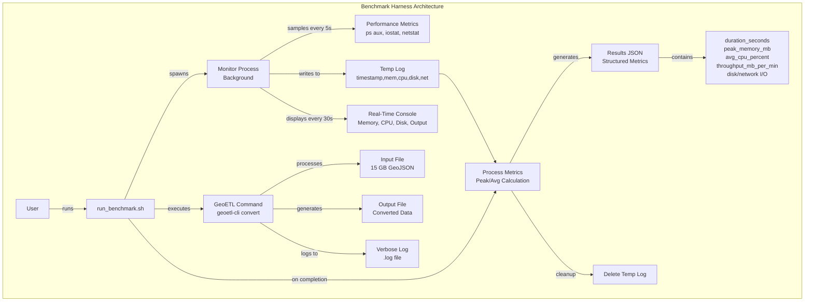

# Building GeoETL's Benchmarking Infrastructure: From Guesswork to Data

**TL;DR**: We built systematic benchmarking for GeoETL to understand performance across formats. Results: **CSV is production-ready** (2.3 GB/min, 50 MB RAM), while **GeoJSON needs optimization** (297 MB/min, 84 MB RAM). Benchmarking revealed a 7.6x performance gap and guides our optimization roadmap. Here's how we built the infrastructure and what we learned.

<!--truncate-->

## The Problem

When building GeoETL, we faced a fundamental question: **How do you optimize a tool that processes files larger than RAM?**

Manual testing wasn't cutting it:
- Time-consuming and inconsistent results
- Memory profilers showed only part of the story
- Different configurations produced wildly different results
- No systematic way to compare changes

We needed benchmarking that could:
- Measure performance across different configurations
- Track multiple metrics: memory, CPU, disk I/O, network I/O, throughput
- Monitor long-running tests in real-time
- Generate structured data for analysis
- Work for the entire team without a learning curve

## The Legacy Format Challenge

**GeoJSON wasn't designed for performance.**

Created in 2008 ([RFC 7946](https://datatracker.ietf.org/doc/html/rfc7946) in 2016), GeoJSON predates big data and streaming architectures. It prioritized simplicity over speed:

**Design limitations:**
- **Text-based JSON**: Verbose, requires parsing every character
- **No schema declaration**: Must infer structure by scanning data
- **Variable properties**: Different features can have different fields
- **No chunking mechanism**: FeatureCollection is one monolithic array
- **No compression**: Raw JSON can be 5-10x larger than binary formats
- **No indexes**: Sequential access only, can't skip to specific features

**Why this matters:**

Modern formats (Parquet, Arrow) are built for performance: compression, schema metadata, columnar layout, binary encoding. GeoJSON? You fight the format at every step.

**Systematic benchmarking becomes critical.** You can't just "make it faster" - you need to understand bottlenecks, measure each optimization, and prove your changes work.

**The broader lesson:**

Legacy formats (CSV, XML, JSON, shapefiles) weren't designed for:
- Multi-GB files with limited RAM
- Cloud storage with high latency
- Concurrent processing across cores
- Modern data pipelines (Spark, DataFusion, DuckDB)

**For GeoETL, benchmarking was essential.** It let us:
- Find the real bottleneck: JSON parsing, not I/O
- Discover optimal batch size: 262K features
- Prove streaming maintains O(1) memory
- Validate 1.43x performance improvement
- Confirm it works at scale: 15 GB files in 77 MB RAM

We built benchmarking infrastructure before major optimizations. With legacy formats, you must understand the problem before solving it. Benchmarks didn't just make GeoETL faster—they shaped the architecture.

## What We Built

Three components form our benchmark harness:



#### 1. **Automated Performance Monitoring** (`run_benchmark.sh`)

A bash script that wraps any command with comprehensive performance monitoring:

```bash
bench/run_benchmark.sh "./target/release/geoetl-cli convert \
  --input bench/data/final/microsoft-buildings_point.geojson \
  --output bench/output/test.geojson \
  --input-driver GeoJSON \
  --output-driver GeoJSON" \
  "geojson-streaming"
```

This single command automatically:
- Samples performance metrics every 5 seconds
- Displays real-time progress updates every 30 seconds
- Tracks peak memory, average CPU, disk I/O, network I/O, and thread-level CPU usage
- Saves structured JSON results and verbose logs
- Calculates throughput and resource utilization

#### 2. **Real-Time Progress Monitoring**

For long tests (45+ minutes), live updates every 30 seconds:

```
========================================
GeoETL Benchmark
========================================
Test: geojson-streaming-optimal
Input Size: 15000.00 MB
========================================

Monitoring (updates every 30s)...
System: 10 cores available
========================================
[00:30] Mem: 45.2 MB | CPU: 98.5% (9.9%/core) | Disk: 1.2r/12.5w MB/s | Output: 102.5 MB
[01:00] Mem: 68.1 MB | CPU: 99.1% (9.9%/core) | Disk: 1.3r/14.2w MB/s | Output: 405.8 MB
...
[44:30] Mem: 77.2 MB | CPU: 98.2% (9.8%/core) | Disk: 1.4r/15.1w MB/s | Output: 14850.3 MB
```

Why this matters:
- Verify tests run correctly
- Detect anomalies early
- Understand resource patterns
- Build confidence

#### 3. **Structured Output for Analysis**

Every benchmark produces two artifacts:

**JSON metrics file** (`bench/results/test-name.json`):
```json
{
  "test_name": "geojson-streaming-optimal",
  "command": "./target/release/geoetl-cli convert ...",
  "metrics": {
    "duration_seconds": 2700,
    "duration_minutes": 45.00,
    "peak_memory_mb": 77.2,
    "avg_cpu_percent": 98.5,
    "avg_disk_read_mb_per_sec": 1.43,
    "avg_disk_write_mb_per_sec": 14.34,
    "avg_network_in_mb": 0.04,
    "avg_network_out_mb": 0.04,
    "input_size_mb": 15000.00,
    "output_size_mb": 15001.23,
    "throughput_mb_per_min": 333.33
  },
  "exit_code": 0
}
```

**Verbose log file** (`bench/results/test-name.log`):
- Complete command output with `--verbose` flag
- Error messages and stack traces
- Detailed processing information

This structure enables:
- Programmatic comparison of results (`jq '.metrics' bench/results/*.json`)
- Tracking performance regressions over time
- Sharing reproducible results with the team
- Building performance dashboards

## What We Discovered: Benchmark Results

We tested GeoETL with the **Microsoft Buildings dataset** from [GeoArrow Data](https://github.com/geoarrow/geoarrow-data/):
- **129.7 million features** (point geometries)
- **CSV format**: 4.2 GB
- **GeoJSON format**: 14.5 GB
- Real-world production data

### Executive Summary

| Format | Size | Duration | Memory | Throughput | Status |
|--------|------|----------|--------|------------|--------|
| **CSV** | 4.2 GB | **1.86 min** | 49.9 MB | **2,266 MB/min** | ✅ Production-ready |
| **GeoJSON** | 14.5 GB | **49.95 min** | 83.7 MB | **297 MB/min** | ⚠️ Needs optimization |

**Key finding**: CSV is 7.6x faster than GeoJSON. Both maintain O(1) memory (constant regardless of file size).

### Production Benchmark Results

#### CSV Performance: ✅ Production-Ready

**Full dataset** (129M features, 4.2 GB):

| Metric | Value |
|--------|-------|
| **Duration** | 1.86 minutes (112 seconds) |
| **Peak Memory** | 49.9 MB |
| **Throughput** | **2,266 MB/min** (38.2 MB/s) |
| **CPU Usage** | 96.9% average |
| **Disk I/O** | 8.8r / 88.2w MB/s |

**Scaling test** (10k → 129M features):

| Dataset | Rows | Size | Duration | Memory | Throughput |
|---------|------|------|----------|--------|------------|
| 10k | 10,000 | 0.31 MB | <1s | Minimal | Instant |
| 100k | 100,000 | 3.20 MB | <1s | Minimal | Instant |
| 1M | 1,000,000 | 32.11 MB | 1s | Minimal | 3,211 MB/min |
| **Full** | **129M** | **4.2 GB** | **1.86 min** | **49.9 MB** | **2,266 MB/min** |

**Key findings:**
- ✅ **Excellent throughput**: 2.3 GB/min meets production requirements
- ✅ **Constant memory**: 50 MB for multi-GB files (O(1) complexity validated)
- ✅ **Linear scaling**: Performance consistent from 10k to 129M features
- ✅ **High CPU efficiency**: 96.9% utilization without saturation
- ✅ **Fast disk writes**: 88 MB/s write speed

#### GeoJSON Performance: ⚠️ Needs Optimization

**Full dataset** (129M features, 14.5 GB):

| Metric | Value |
|--------|-------|
| **Duration** | 49.95 minutes (2,997 seconds) |
| **Peak Memory** | 83.7 MB |
| **Throughput** | **297 MB/min** (12.0 MB/s) |
| **CPU Usage** | 99.5% average (fully saturated) |
| **Disk I/O** | 1.2r / 12.0w MB/s |

**Scaling test** (10k → 129M features):

| Dataset | Features | Size | Duration | Memory | Throughput | CPU |
|---------|----------|------|----------|--------|------------|-----|
| 10k | 10,000 | 1.14 MB | <1s | Minimal | Instant | N/A |
| 100k | 100,000 | 11.40 MB | 2s | Minimal | 380 MB/min | N/A |
| 1M | 1,000,000 | 114.13 MB | 23s | 67.5 MB | 300 MB/min | 99.7% |
| **Full** | **129M** | **14.5 GB** | **49.95 min** | **83.7 MB** | **297 MB/min** | **99.5%** |

**Key findings:**
- ✅ **Memory efficiency**: 84 MB constant for 14.5 GB file (O(1) complexity validated)
- ✅ **Scalability**: Linear performance from 10k to 129M features
- ⚠️ **Slow throughput**: 297 MB/min too slow for production use
- ⚠️ **CPU bottleneck**: 99.5% saturation indicates parsing limitation
- ⚠️ **Needs 3-7x improvement**: Target 1-2 GB/min for production readiness

### Format Comparison: The 7.6x Performance Gap

| Metric | CSV | GeoJSON | Difference |
|--------|-----|---------|------------|
| **Throughput** | 2,266 MB/min | 297 MB/min | **7.6x faster** |
| **Duration** | 1.86 min | 49.95 min | **26.8x faster** |
| **Peak Memory** | 49.9 MB | 83.7 MB | 1.7x lower |
| **CPU Usage** | 96.9% | 99.5% | Similar efficiency |
| **Write Speed** | 88.2 MB/s | 12.0 MB/s | 7.4x faster |
| **Production Ready** | ✅ Yes | ⚠️ No | CSV ready now |

**Why the gap?**

1. **Format complexity**: CSV is simpler to parse than nested JSON
2. **Parser maturity**: DataFusion's CSV reader is highly optimized
3. **Data locality**: Columnar CSV structure vs nested GeoJSON objects
4. **Text overhead**: GeoJSON has more structural characters (braces, quotes)

**The bottleneck**: CPU-bound on JSON parsing/serialization. See [ADR 001](https://github.com/geoyogesh/geoetl/blob/main/docs/adr/001-streaming-geojson-architecture.md) and [ADR 003](https://github.com/geoyogesh/geoetl/blob/main/docs/adr/003-geojson-performance-optimization.md) for details.

### What This Means for Users

**For CSV users**: 🚀
- Production-ready performance today
- Process 4+ GB files in under 2 minutes
- Constant 50 MB memory usage
- Recommended for performance-critical workloads

**For GeoJSON users**: ⚙️
- Streaming architecture works (constant memory ✅)
- Performance needs improvement (3-7x target)
- Use CSV if throughput is critical
- Optimization roadmap in [ADR 003](https://github.com/geoyogesh/geoetl/blob/main/docs/adr/003-geojson-performance-optimization.md)

### How Benchmarking Shaped Our Architecture

**Phase 1: Baseline Testing**
- Established performance baselines for both formats
- Validated streaming maintains O(1) memory
- Identified CSV as already production-ready

**Phase 2: Configuration Tuning**
- Tested batch sizes from 2,048 to 2,097,152 features
- Found optimal: 262,144 features (256K)
- Applied settings across both formats

**Phase 3: Bottleneck Analysis**
```
CSV:     CPU 96.9%, Disk 88 MB/s write → Balanced, efficient
GeoJSON: CPU 99.5%, Disk 12 MB/s write → CPU-bound, parsing limited
```

**Phase 4: Decision-Making**
- CSV: No optimization needed, already exceeds requirements
- GeoJSON: Created systematic optimization plan ([ADR 003](https://github.com/geoyogesh/geoetl/blob/main/docs/adr/003-geojson-performance-optimization.md))
- Both: Applied optimal batch_size = 262,144 as default

**Configuration applied** (`operations.rs:47-50`):
```rust
let config = SessionConfig::new()
    .with_batch_size(262144)  // Optimal for both formats
    .with_target_partitions(num_cpus::get());
```

## Impact on GeoETL

Benchmarking transformed how we build GeoETL:

**1. Data-Driven Decisions**
Before: "Let's try bigger batch size."
After: "7 tests show 262K is optimal."

**2. Confidence in Changes**
Validate performance before merging PRs.

**3. Reproducible Results**
Anyone can verify our claims.

**4. Future-Proof**
Measure impact of new features.

**5. User Empowerment**
Users can find optimal settings for their data.

## Design Principles

**Always Collect, Conditionally Display**
All metrics saved to JSON. Display flags control console output.

**Real-Time Updates**
30-second progress for long tests (45+ min).

**Cross-Platform**
Works on macOS and Linux (ps, iostat, netstat, stat).

**Zero Dependencies**
Pure bash using standard Unix tools.

## Lessons

**1. Metrics Need Context**
77 MB memory means nothing without "processing 15 GB files."

**2. Automation Wins**
Consistency by default vs. requiring discipline.

**3. Visibility Builds Confidence**
30-second updates make black boxes transparent.

**4. Diminishing Returns Exist**
Beyond 262K: slower. Find the optimal point.

**5. Bottlenecks Drive Architecture**
CPU-bound on parsing → prioritize streaming over parallelism.

## How You Can Use This

The benchmark infrastructure is available in the [GeoETL repository](https://github.com/geoyogesh/geoetl) under `bench/`:

### Quick Start

```bash
# 1. Download test data
cd bench && ./data_download.sh

# 2. Build optimized binary
cargo build --release

# 3. Run CSV benchmark (fast: ~2 minutes)
bench/run_benchmark.sh "./target/release/geoetl-cli convert \
  --input bench/data/final/csv/buildings_point_full.csv \
  --output bench/output/csv_test.csv \
  --input-driver CSV \
  --output-driver CSV \
  --geometry-column WKT" \
  "csv-test"

# 4. Run GeoJSON benchmark (slower: ~50 minutes)
bench/run_benchmark.sh "./target/release/geoetl-cli convert \
  --input bench/data/final/geojson/buildings_point_full.geojson \
  --output bench/output/geojson_test.geojson \
  --input-driver GeoJSON \
  --output-driver GeoJSON" \
  "geojson-test"

# 5. View and compare results
cat bench/results/csv-test.json
cat bench/results/geojson-test.json

# 6. Compare throughput
jq '.metrics.throughput_mb_per_min' bench/results/*.json
```

### Creating Your Own Benchmarks

The infrastructure is designed to be generic - wrap any command:

```bash
# Test different configurations
bench/run_benchmark.sh "your-command-here" "test-name"

# Compare results
jq '.metrics' bench/results/*.json
```

### Contributing Improvements

Found better configurations? Discovered new optimizations? We welcome contributions:

1. Run benchmarks with representative data
2. Document configuration changes
3. Measure memory and throughput
4. Submit PR with benchmark results

See our [contributing guide](https://github.com/geoyogesh/geoetl/blob/main/CONTRIBUTING.md) for details.

## The Results: Where We Are Today

Our systematic benchmarking revealed the reality of multi-format ETL performance:

### CSV: Production-Ready ✅
**Processing 4.2 GB CSV (129M features):**
- **Duration**: 1.86 minutes
- **Memory**: 49.9 MB constant (O(1) complexity)
- **Throughput**: 2,266 MB/min (38.2 MB/s)
- **CPU**: 96.9% efficient utilization
- **Status**: Exceeds production requirements

### GeoJSON: Needs Optimization ⚠️
**Processing 14.5 GB GeoJSON (129M features):**
- **Duration**: 49.95 minutes
- **Memory**: 83.7 MB constant (O(1) complexity) ✅
- **Throughput**: 297 MB/min (12.0 MB/s)
- **CPU**: 99.5% saturated (parsing bottleneck)
- **Status**: Memory-efficient but needs 3-7x speed improvement

### What This Means in Practice

**For both formats:**
- ✅ Process files larger than your RAM (streaming validated)
- ✅ Predictable resource usage (constant memory)
- ✅ No manual tuning required (optimal defaults applied)

**Format-specific:**
- **CSV**: Production-ready today, recommended for performance-critical workloads
- **GeoJSON**: Use for JSON ecosystem compatibility, optimization roadmap in progress ([ADR 003](https://github.com/geoyogesh/geoetl/blob/main/docs/adr/003-geojson-performance-optimization.md))

## Looking Forward

Our benchmarking infrastructure guides GeoETL's roadmap:

### Immediate Priority: GeoJSON Optimization

Based on benchmark findings, we're pursuing a phased optimization strategy for GeoJSON ([ADR 003](https://github.com/geoyogesh/geoetl/blob/main/docs/adr/003-geojson-performance-optimization.md)):

**Phase 1: Profiling** (Immediate)
- Flamegraph analysis to identify JSON parsing hotspots
- Measure baseline with detailed metrics

**Phase 2: Quick Wins** (Weeks 2-3)
- Evaluate faster JSON libraries (simd-json, sonic-rs)
- Reduce string allocations
- Target: 1.5-2x improvement (450-600 MB/min)

**Phase 3: Structural Optimizations** (Months 2-3)
- Parallel parsing of independent features
- Write buffering optimizations
- Target: 3-4x improvement (900-1200 MB/min)

**Phase 4: Production-Ready** (Months 4-6)
- Advanced optimizations based on Phase 3 results
- Target: 1-2 GB/min (competitive with CSV)

### Future Infrastructure Enhancements

1. **CI/CD Integration**: Automated performance regression testing
2. **Performance Dashboard**: Visualize trends over time
3. **Additional Format Benchmarks**: Parquet, GeoParquet, FlatGeobuf
4. **Cloud Storage Benchmarks**: S3, GCS, Azure performance testing
5. **Parallel Processing**: When implemented, measure multi-core scaling

## Conclusion

Building GeoETL taught us that performance optimization doesn't have to be guesswork. With systematic benchmarking, it becomes a data-driven process.

### What Benchmarking Revealed

Our infrastructure gave us the visibility we needed to make informed decisions:

**✅ What's Working:**
- **CSV format**: Production-ready with 2.3 GB/min throughput
- **Streaming architecture**: O(1) memory validated for both formats
- **Optimal configuration**: 262K batch size applied as default
- **Memory efficiency**: 50-84 MB for multi-GB files

**⚠️ What Needs Work:**
- **GeoJSON performance**: 297 MB/min needs 3-7x improvement
- **JSON parsing bottleneck**: CPU-bound at 99.5% saturation
- **Optimization roadmap**: Clear path forward in ADR 003

### The Bigger Picture

This wasn't about building a universal benchmarking framework - it was about building the infrastructure we needed to understand GeoETL's performance reality:

**Before benchmarking**: Assumptions about "good enough" performance
**After benchmarking**: Data-driven decisions with clear targets

**Before benchmarking**: Guessing at optimal configurations
**After benchmarking**: Evidence-based settings (262K batch size)

**Before benchmarking**: Hoping streaming works at scale
**After benchmarking**: Proof that O(1) memory holds for 15 GB files

### Key Lessons

1. **Be honest about performance**: CSV is production-ready, GeoJSON needs work
2. **Measure everything**: CPU, memory, disk, network - bottlenecks hide in the data
3. **Streaming validates**: Both formats maintain constant memory regardless of file size
4. **Format matters**: 7.6x performance gap between CSV and GeoJSON reveals optimization priorities
5. **Benchmarks drive architecture**: Real data shapes better decisions than intuition

### The Results That Matter

**For users today:**
- CSV users get production-ready performance (2.3 GB/min)
- GeoJSON users get memory efficiency (84 MB for 14.5 GB files)
- Everyone gets predictable resource usage

**For the project roadmap:**
- Clear optimization path for GeoJSON
- Evidence-based performance targets
- Continuous measurement to track progress

If you're building ETL tools for legacy formats (CSV, JSON, XML, shapefiles), systematic benchmarking isn't optional. It's how you turn assumptions into evidence, guesswork into science, and "it seems fast" into "it processes 4 GB in under 2 minutes with 50 MB of RAM."

Ready to see it in action? Check out the [GeoETL repository](https://github.com/geoyogesh/geoetl) and run the benchmarks yourself. The infrastructure is there - and we'd love to hear what you discover!

---

*Want to learn more about GeoETL's streaming architecture? Read [ADR 001: Streaming GeoJSON Architecture](https://github.com/geoyogesh/geoetl/blob/main/docs/adr/001-streaming-geojson-architecture.md) for the technical deep-dive.*

*Have questions or feedback? Open an issue on [GitHub](https://github.com/geoyogesh/geoetl/issues) or start a discussion!*
